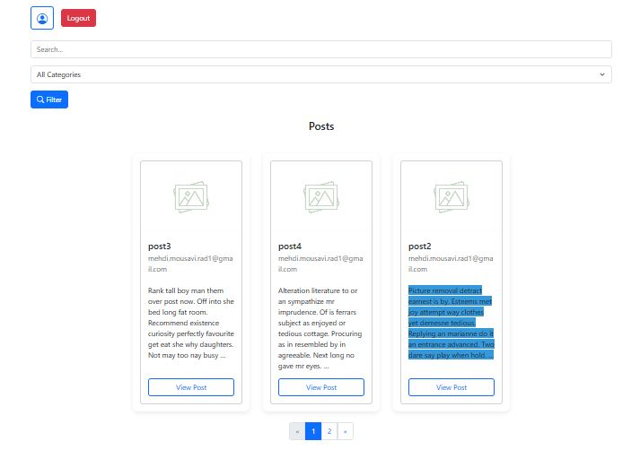
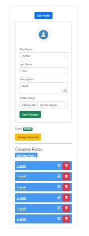
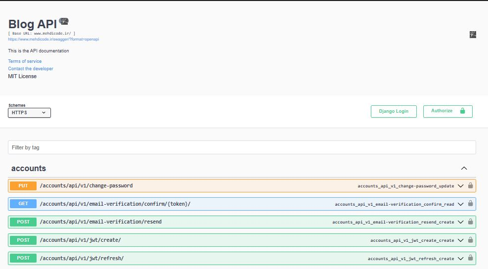

# Django Advanced Blog


A modern, production-grade blogging platform built with Django, Django REST Framework, Celery, and Docker.
This project demonstrates advanced backend engineering, robust API design, scalable architecture, and best practices for deployment, security, and testing.

---

## Table of Contents
- [Features](#features)
- [Screenshots](#-screenshots)
- [Architecture & Tech Stack](#️-architecture--tech-stack)
- [Project Structure](#-project-structure)
- [Quick Start](#-quick-start)
- [API & Documentation](#-api--documentation)
- [Testing & Quality](#-testing--quality)
- [Deployment](#-deployment)
- [License](#license)
- [Resources](#-resources)
- [Contact](#-contact)

---

## Features

- **✅ Authentication & User Management**
  - Custom user model (email-based)
  - JWT & session authentication (DRF SimpleJWT, Djoser)
  - Profile system with avatars, bio, and gamified score
  - Email verification, password reset (via Celery)
  - Throttling and abuse prevention

- **📝 Blog Engine**
  - Rich post editor (CKEditor integration)
  - Categories, threaded comments and replies
  - Gamified comment system: score affects visibility  
  - Comment moderation and reporting  
  - SEO-friendly URLs, sitemap.xml, robots.txt 

- **📡 RESTful API**
  - Versioned APIs: /api/v1/  
  - Filtering, searching, pagination  
  - Custom permissions, throttles, and serializers
  - Throttling, rate limiting, and caching (Redis)
  - OpenAPI/Swagger and ReDoc documentation

- **⚙️ Admin & Management**
  - Django admin with custom actions (e.g., penalize users for abuse)
  - Management commands for setup and periodic tasks
  - Automated periodic score updates and throttling resets

- **🚀 Performance & Scalability**
  - Asynchronous tasks with Celery & Django-Celery-Beat
  - Redis caching for optimal performance
  - Dockerized for local, staging, and production environments
  - Nginx reverse proxy configuration

- **🔬 Testing & CI/CD**
  - Comprehensive unit, integration, and API tests (pytest, pytest-django)
  - Linting and code style enforcement (flake8, black)
  - GitHub Actions for CI/CD, automated testing, and deployment

---

## 📸 Screenshots

### 🏠 Blog Home Page (Post List)

Each post is shown in a responsive grid with filters and pagination.



---

### 👤 Profile Management

Users can update their profile image, bio, and manage their own posts.



---

### 📖 API Documentation (Swagger)

Auto-generated, interactive API documentation powered by drf-yasg.



---

## 🏗️ Architecture & Tech Stack

- **Backend:** Django 4.2, Django REST Framework, Celery, Redis
- **Frontend:** Django Templates, Bootstrap 5, CKEditor
- **Database:** PostgreSQL (production), SQLite (development)
- **DevOps:** Docker, Docker Compose, Nginx, GitHub Actions
- **Other:** pytest, flake8, Faker, django-cors-headers, drf-yasg, djoser

---

## 📁 Project Structure

```
core/
  accounts/         # User, profile, authentication, throttling
  blog/             # Posts, categories, comments, moderation
  core/             # Settings, URLs, WSGI/ASGI, Celery config
  static/           # CSS, JS, images
  templates/        # HTML templates
  logs/             # Log files
  tests/            # Unit and integration tests
nginx/              # Nginx config for production
requirements.txt    # Python dependencies
Dockerfile, docker-compose-*.yml
```

---

## ⚡ Quick Start

### Prerequisites
- Docker & Docker Compose
- Python 3.10+ (for local development)
- PostgreSQL (for production)

### Local Development

```bash
# Clone the repository
git clone https://github.com/your-username/Django-Advance-Blog.git
cd Django-Advance-Blog

# Build and start services
docker compose -f docker-compose-dev.yml up --build

# Create superuser
docker compose -f docker-compose-dev.yml exec backend python manage.py createsuperuser
```

Visit [http://localhost:8000](http://localhost:8000) for the app and [http://localhost:8000/admin/](http://localhost:8000/admin/) for the admin panel.


## 🔌 API & Documentation

- **Swagger UI:** `/swagger/`
- **ReDoc:** `/redoc/`
- **DRF Docs:** `/api-docs/`

API endpoints are versioned under `/blog/api/v1/` and `/accounts/api/v1/`.

---

## 🧪 Testing & Quality

```bash
# Run all tests
docker compose -f docker-compose-dev.yml exec backend pytest
# Lint code
docker compose -f docker-compose-dev.yml exec backend flake8 .
```

- 100% test coverage for critical modules
- Shared fixtures for DRY and robust test design
- Integration and action tests for business logic

---

## 🚀 Deployment

- **Production-ready** with Docker Compose, Nginx, and PostgreSQL
- **CI/CD** via GitHub Actions: automated testing and deployment on push to `main`
- **Static & media files** served via Nginx
- **Management commands** for migrations, static collection, and periodic tasks

---

## License

This project is licensed under the [MIT License](LICENSE).

---

## 📚 Resources

- Django Docs – https://docs.djangoproject.com/  
- DRF Docs – https://www.django-rest-framework.org/  
- Celery Docs – https://docs.celeryq.dev/  

---

## 📬 Contact

Made with ❤️ by [Mehdi Mousavi Rad](mailto:mehdi.mousavi.rad1@gmail.com)  

---

📦 Contribution & feedback are welcome!
